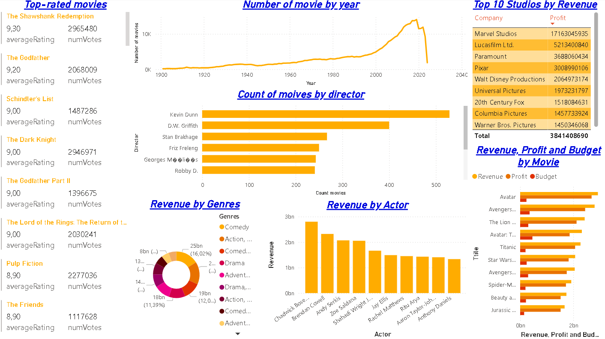
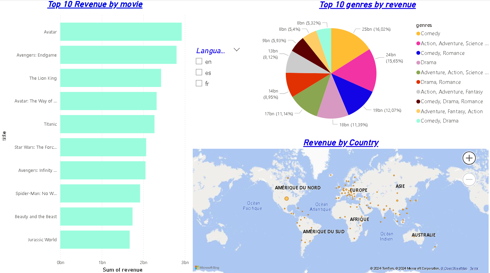
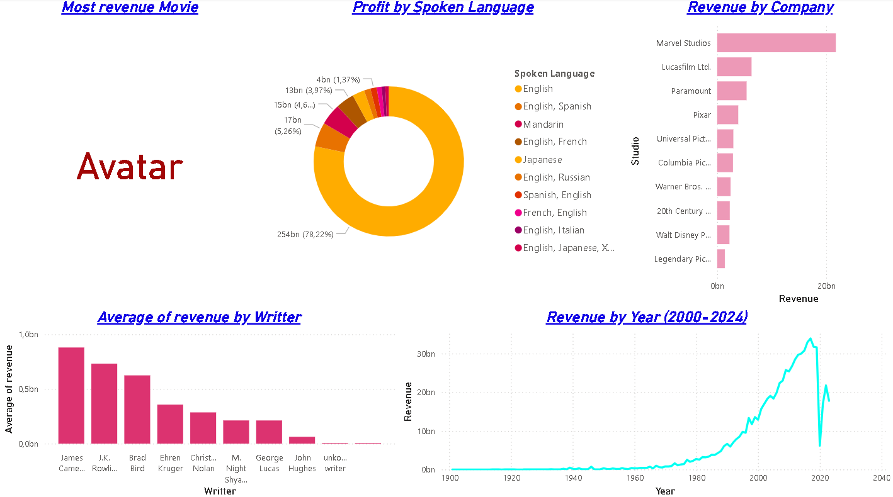
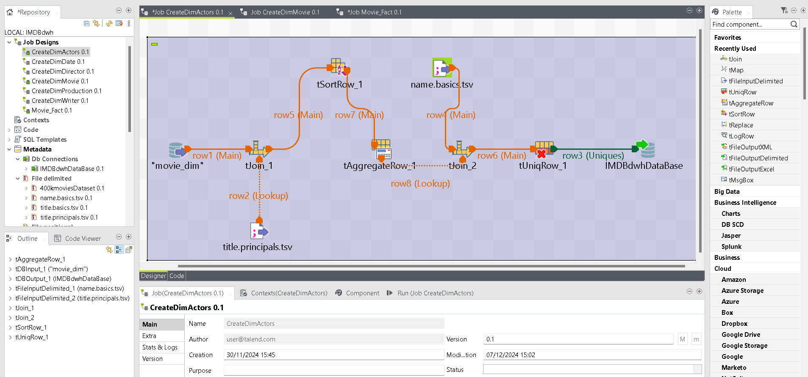
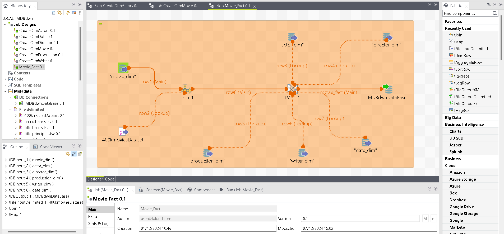

# **ETL Movies Data Warehouse & Analysis Project** 🎬📊  

## **Project Overview**  
Welcome to the **ETL Movies Data Warehouse and Analysis** project, where raw data from the cinematic world is transformed into meaningful insights! This project demonstrates the full ETL (Extract, Transform, Load) workflow using **IMDb datasets** and Talend Open Studio. The processed data is stored in a MySQL database, enabling interactive analysis through **Power BI dashboards**.

### **Key Features**  
✨ **ETL Pipeline**:  
- **Extract**: Data is sourced from Kaggle and IMDb datasets.  
- **Transform**: Data cleaning, deduplication, sorting, and aggregation using **Talend Open Studio** components.  
- **Load**: Processed data is loaded into a MySQL database for efficient querying.  

📦 **Data Warehouse**:  
- A structured data warehouse built on a **star schema** with optimized fact and dimension tables for analytics.  

📊 **Interactive Dashboards**:  
- **Power BI** visualizations provide insights into movies, actors, and trends.  
- KPIs include top movies, actor contributions, and trends over time.  

---

## **Technologies Used** 🚀  
This project integrates the following tools and technologies to implement the ETL pipeline and visualization:  
- **ETL Tool**: [Talend Open Studio](https://www.talend.com)  
- **Database**: MySQL  
- **Visualization Tool**: [Power BI](https://powerbi.microsoft.com)  
- **Data Source**:  
   - IMDb datasets:  
     - `name.basics.tsv.gz`  
     - `title.principals.tsv.gz`  
     - `title.basics.tsv.gz`  
   - Additional movie datasets from **Kaggle**  

---

## **Repository Structure** 📁  
Here is the structure of the project repository:  

```plaintext
ETL_Movies_Project/
├── .git/                     # Git repository files  
├── DataSets/                 # Links of the IMDb and Kaggle datasets  
├── IMDBDWH/                  # Talend jobs and workflows  
├── MySQL_Database/           # SQL scripts for creating tables and loading data  
├── PowerBi_Report/           # Power BI report files  
├── screenshots/              # Images of dashboards and Talend workflows  
├── .gitattributes            # Git attributes file  
├── LICENSE                   # License file  
└── README.md                 # Project documentation (this file)  
```

---

## **Talend Components Used** 🛠️  

During the ETL process, the following Talend Open Studio components were used to clean, filter, and aggregate data:  
- **tFileInputDelimited**: To read raw IMDb TSV files (e.g., `name.basics.tsv`, `title.basics.tsv`).  
- **tUniqRow**: To remove duplicate rows and ensure data integrity.  
- **tJoin**: To join movie and actor datasets on common keys like `tconst` and `nconst`.  
- **tAggregate**: To calculate metrics such as movie counts or aggregated KPIs.  
- **tSortRow**: To sort rows based on specific fields, ensuring organized data.  

---

## **Getting Started** ⚙️  

### **Prerequisites** 🔧  
Ensure you have the following installed to set up the project locally:  
1. **Talend Open Studio**: Download and install from [Talend's website](https://www.talend.com).  
2. **MySQL**: Install and set up a MySQL server to host the data warehouse.  
3. **Power BI Desktop**: Install from [Power BI's website](https://powerbi.microsoft.com/en-us/desktop/).  

### **Steps to Run the Project** 📋  

1. **ETL Process (Talend)**:  
   - Open Talend Open Studio and import jobs from the `IMDBDWH` folder.  
   - Run the jobs to extract, clean, and load the datasets into your MySQL database.  

2. **Database Setup**:  
   - Execute the SQL scripts in the `MySQL_Database` folder to create the required tables.  

3. **Power BI Dashboard**:  
   - Open the Power BI file from `PowerBi_Report` and connect it to your MySQL database.  
   - Refresh the data to generate insights and visualizations.  

---

## **Data Sources** 📝  

This project uses publicly available movie datasets:  
1. **IMDb Datasets** ([Source](https://datasets.imdbws.com)):  
   - `name.basics.tsv.gz` – Contains actor and crew information.  
   - `title.principals.tsv.gz` – Links actors/crew to movies.  
   - `title.basics.tsv.gz` – Contains movie titles, years, and genres.  
2. **Kaggle Dataset** ([Source](https://www.kaggle.com/datasets/ggtejas/tmdb-imdb-merged-movies-dataset)):  – Provides additional raw data (400k movies).  

---

## **Power BI Visualizations** 🎨  

Explore insightful visualizations that provide:  
- **Top Movies and Actors**: Analysis of top-performing actors and movies.  
- **Genre Analysis**: Trends and popularity of genres over time.  
- **Actor Contributions**: Movie counts and associations per actor.  

### **Screenshots** 📸  
Examples of the dashboards and workflows:  
- **Power BI Dashboard**




- **Talend Workflow**

  

---

## **Contributing** 🤝  
Contributions are welcome! If you'd like to improve this project, feel free to:  
- Fork the repository.  
- Create a pull request with your changes.  
- Open issues for bugs or suggestions.  

---

## **License** 📝  
This project is licensed under the MIT License. See the `LICENSE` file for more details.  

---

## **Acknowledgments** 🙌  
- IMDb for providing comprehensive movie datasets.  
- Talend Open Studio for ETL processing.  
- Power BI for enabling powerful visual analytics.
